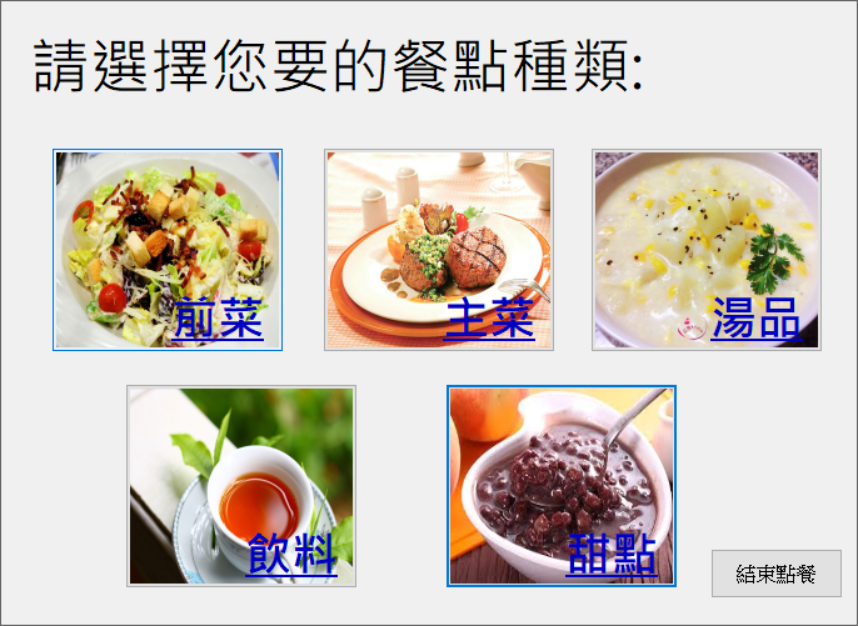
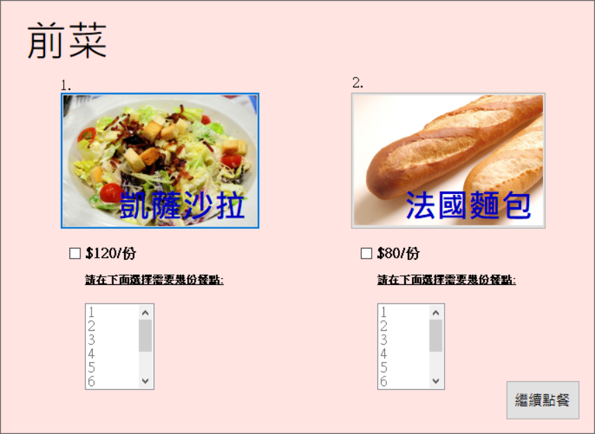
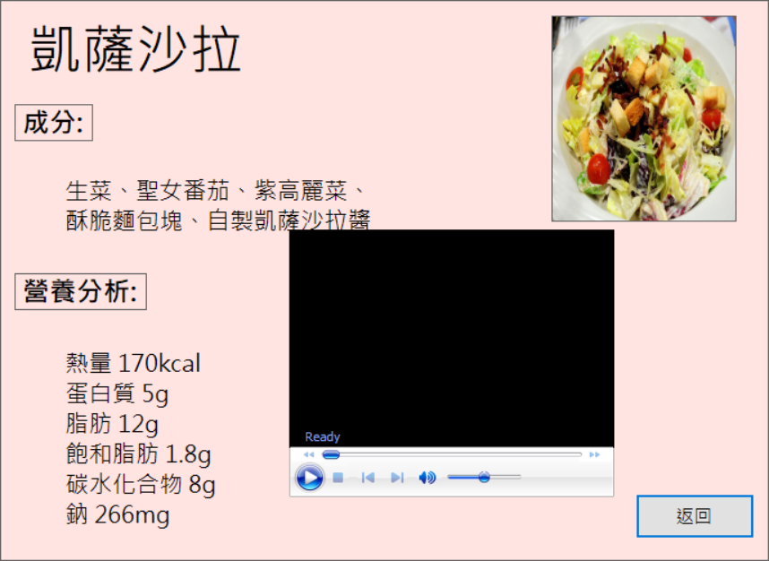
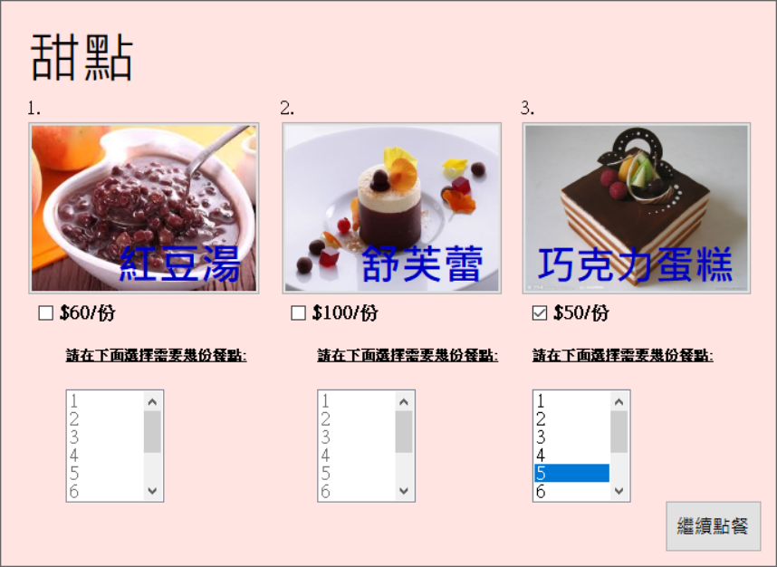
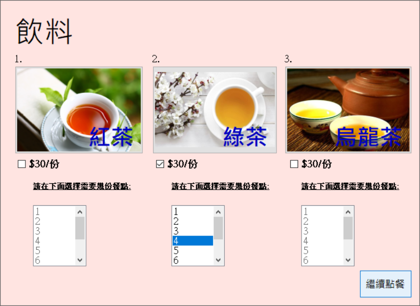
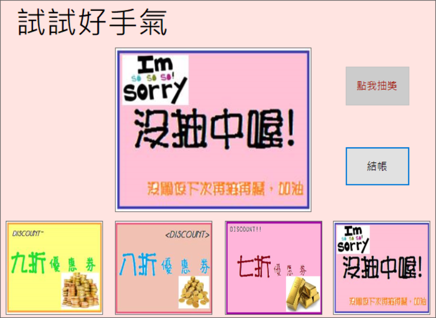
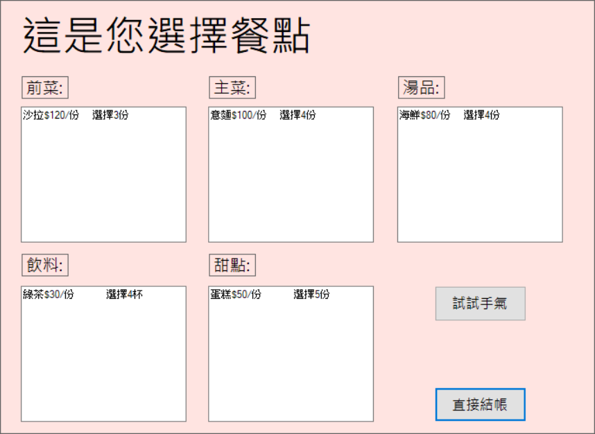
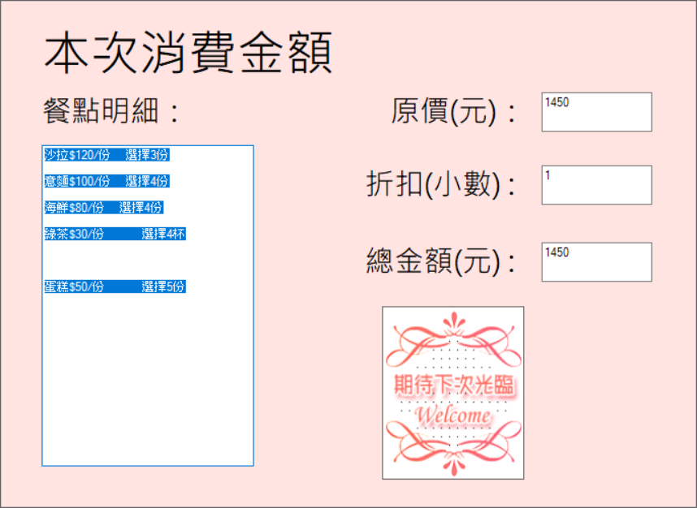

# Dinner Order System

This is a homework project as a pilot test project
for dinner order system

***

## Detail Codes

All of the code files are gather inside the folder, WindowsApplication1, for detailed information. 

* Purpose 
  - Project for designing a dinner system.

* Environment 
  - Visual Studio Community
  - Microsoft® OLE DB Driver 18 for SQL Server®
    [OLEDB Driver 18 Download Site](https://www.microsoft.com/en-us/download/details.aspx?id=56730). 
    For Microsoft Access as our database.

* Programming Language
  - Visual Basic
  - .NET framework

* System Render Image
  - Categories
  - 
  
  - Front Course
  - 
  
  - Salad
  - 
  
  - Dessert
  - 
  
  - Drinks
  - 
  
  - Cupon
  - 
  
  - Selection Result
  - 
  
  - Checkout
  - 
